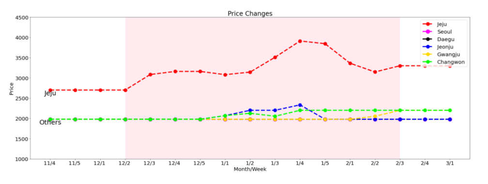

# SmartFarmProject - 데이터 분석 및 시각화
### 개요: 제주도에서 판매되는 작물들의 소매 가격의 특징을 파악하여 SmartFarm 사업의 타당성을 증명한다.
## 개발 Tool 및 Library
* Jupyter
* Python
* Pandas
* matplotlib
## 사용한 Data
* 농산물유통정보 홈페이지: https://www.kamis.or.kr/customer/main/main.do
* 위 홈페이지에서 제공하는 가격 정보를 바탕으로 분석을 진행하였다.
## 데이터 처리 절차
1. 조사 지역 및 농작물(깻잎)을 선정한다.
2. 조사 지역은 제주도에서 이용하는 유통업체와 같은 업체를 이용하는 지역들로 한다.
3. 2019년 11월 4주차부터 2020년 3월 1주차까지 매주 농작물 가격의 평균을 계산한다.
4. 위의 절차를 바탕으로 Dataframe을 생성한다.
## 데이터 분석
#### kaggle 주소: https://www.kaggle.com/sjongyoo/smartfarmproject-dataanalysis-sesame-price

* 우리나라는 겨울철 농작물의 가격 변동이 크다는 점을 바탕으로 기간을 위와 같이 선정하였다.
* 분홍색 영역이 본 그래프에서 가장 중요한 특징을 나타낸다.
 
